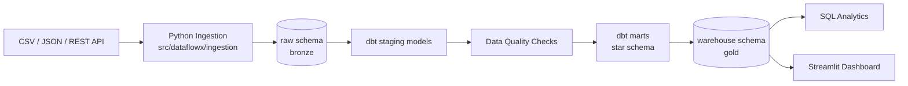
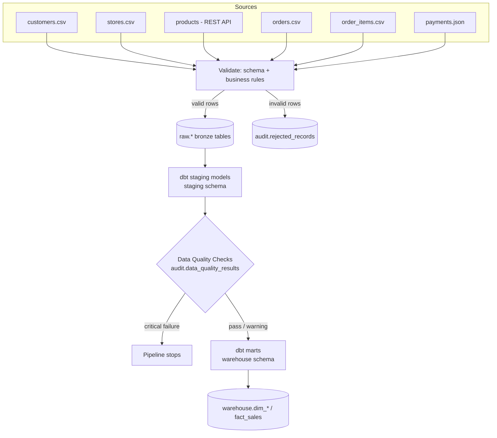
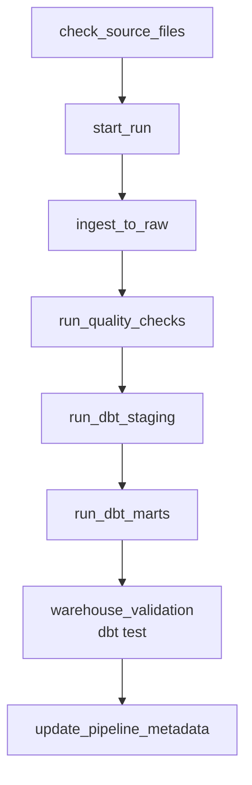
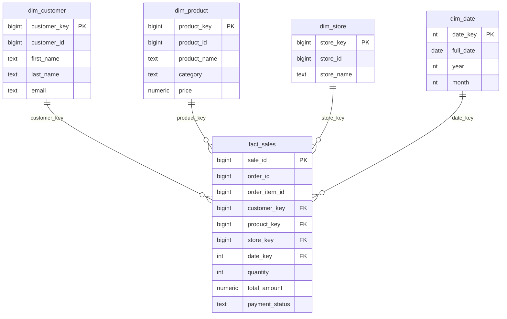
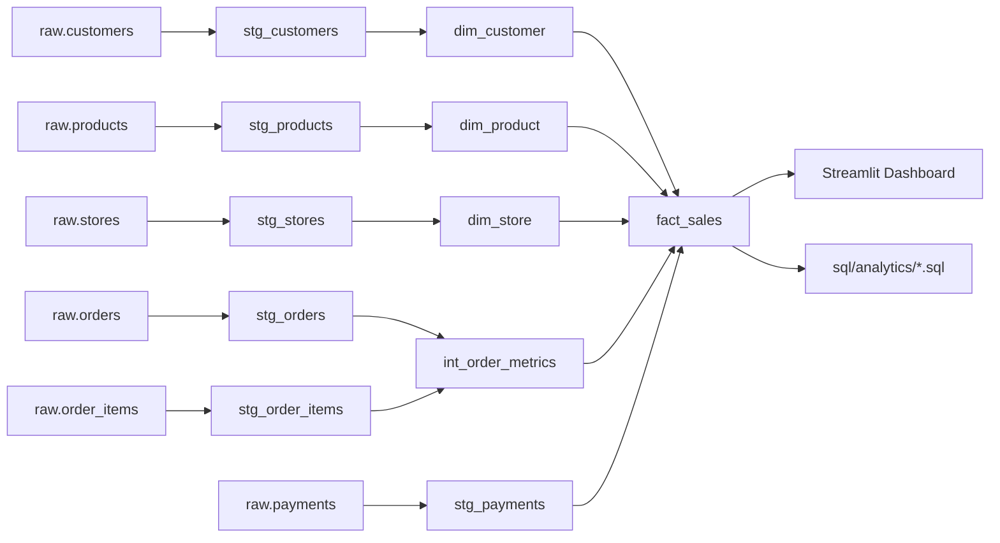

# Architecture

DataFlowX is a batch pipeline that moves e-commerce data through four
layers - bronze (raw), staging, gold (warehouse), and analytics - and
exposes the result through SQL and a Streamlit dashboard.

## 1. High-level architecture

## 2. Data pipeline (bronze -> silver -> gold)

## 3. Airflow DAG

`ingest_to_raw` covers extract, validate, and load together rather than
as three separate Airflow tasks - see the docstring in
`airflow/dags/ecommerce_pipeline.py` for why (passing bulk DataFrames
through XCom is an anti-pattern).

## 4. Star schema

## 5. Data lineage

## Why this stack

- **PostgreSQL** - one database plays the role of raw/staging/warehouse
  storage, which is enough at this data volume and keeps the project
  approachable.
- **Airflow** - orchestrates dependencies, retries, and scheduling; the
  DAG stays thin and calls into `src/dataflowx`.
- **dbt** - SQL transformations (staging -> marts) are declarative,
  testable, and version-controlled, which is easier to reason about than
  ad-hoc Python-generated SQL for this kind of transformation.
- **Docker Compose** - reproducible local environment; not required if
  you already have PostgreSQL and just want to run the Python pipeline.
